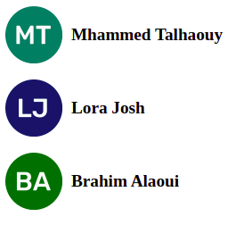

# Avatar for PHP

Generate user avatar using name initials letter.

<kbd></kbd>

## Features

- Data URI image ready (also save as PNG/JPG).
- Consistent color.
- Customize size, shape: square, circle.
- Small, fast.

## Install

Via Composer

```bash
$ composer require tal7aouy/avatar
```

### Implementation

```php
<?php

use Tal7aouy/Avatar\Avatar;

$avatar = new Avatar('Mhammed Talhaouy');

// Square Shape, Size 64px
$avatar = new Avatar('Mhammed Talhaouy', 'square', 64);

// Save Image As PNG/JPEG
$avatar->saveAs('path/to/filename');
$avatar->saveAs('path/to/filename', Avatar::MIME_TYPE_JPEG);

```

```html
" />
```

To use static colour or custom colour use `->setColor($background, $foreground);`

```html
setColor('#000000', '#ffffff');?>" alt="" />
```

# License

**Avatar** is open-sourced software licensed under the [MIT license](LICENSE.md).
